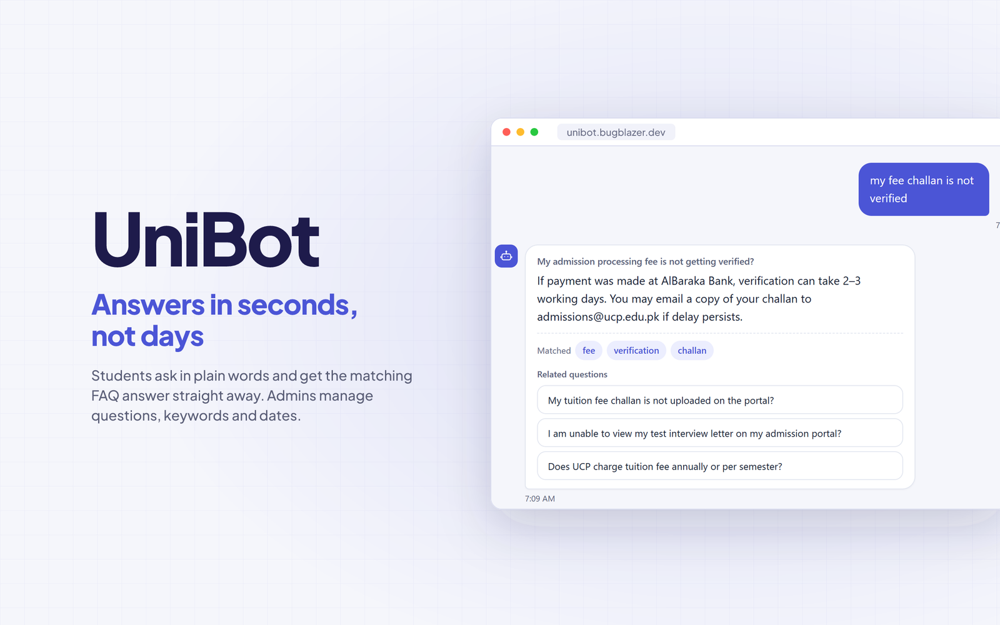
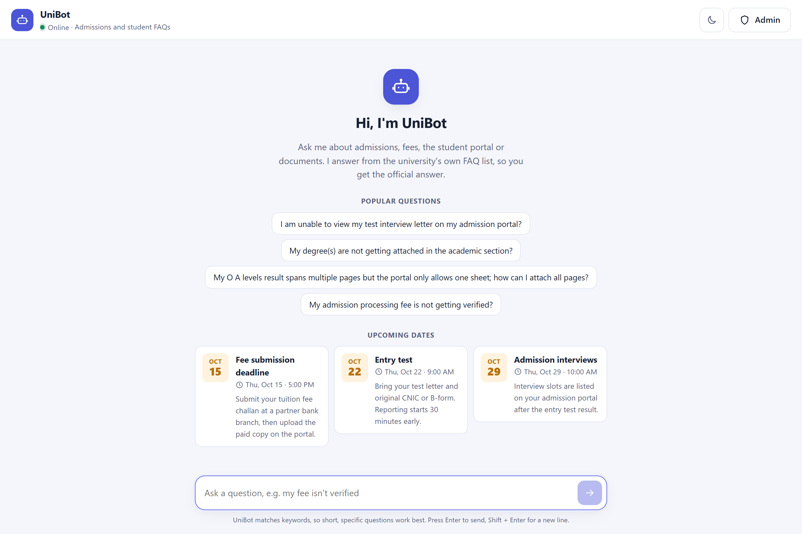
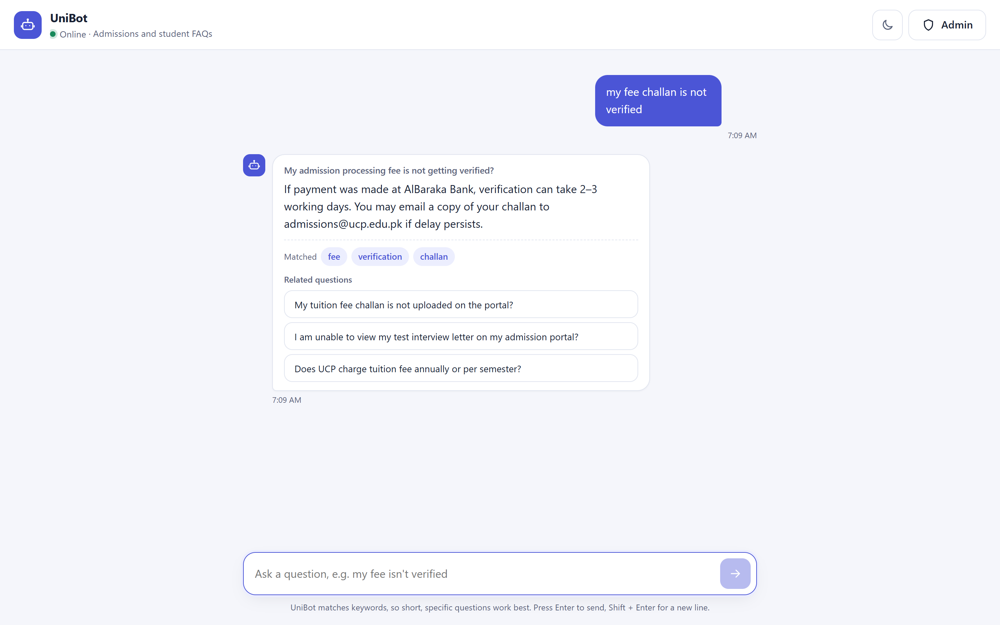
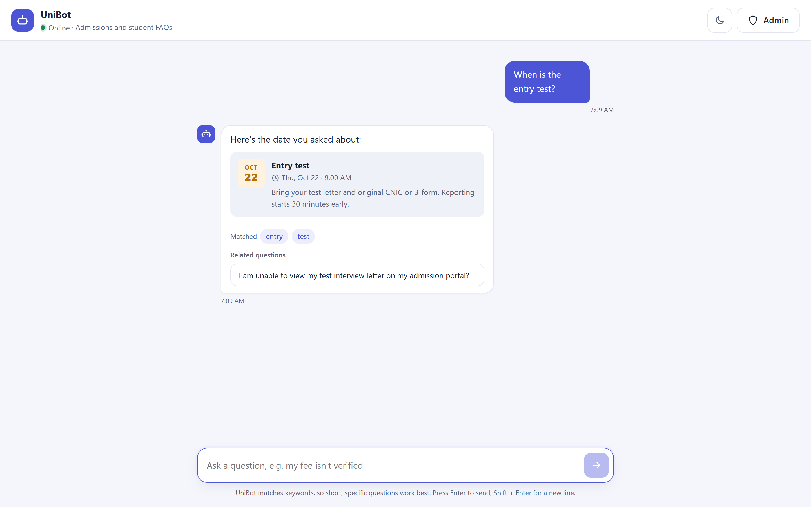
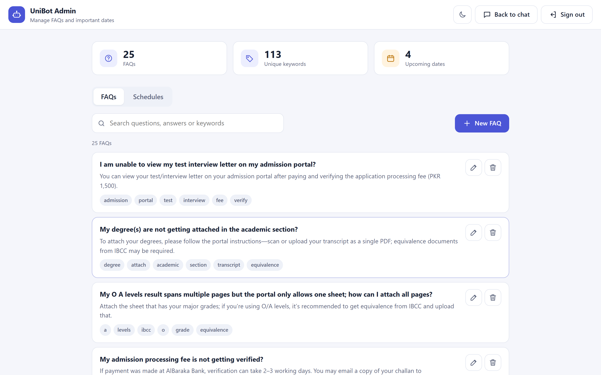
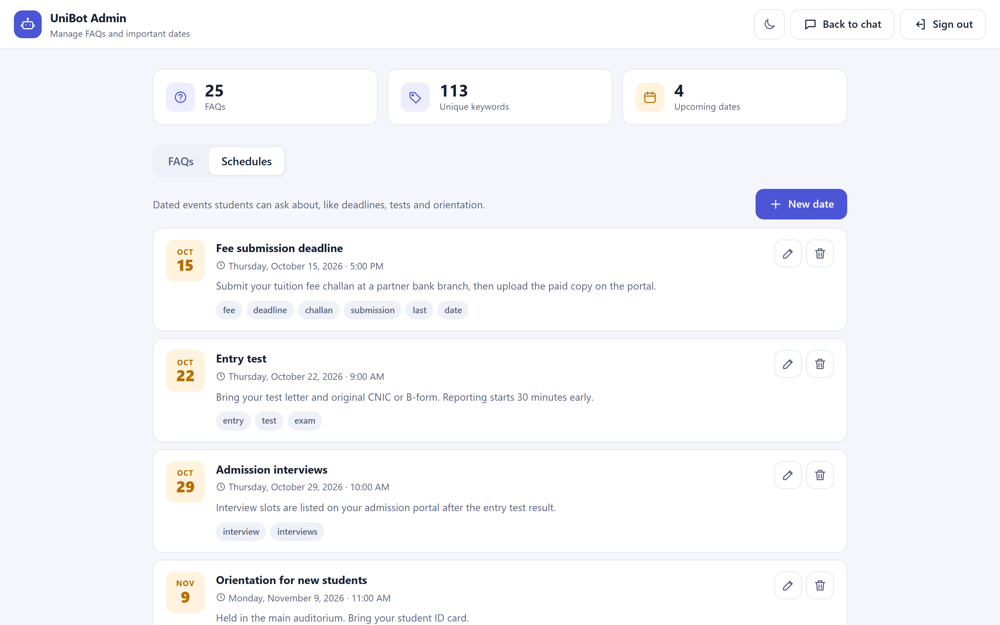
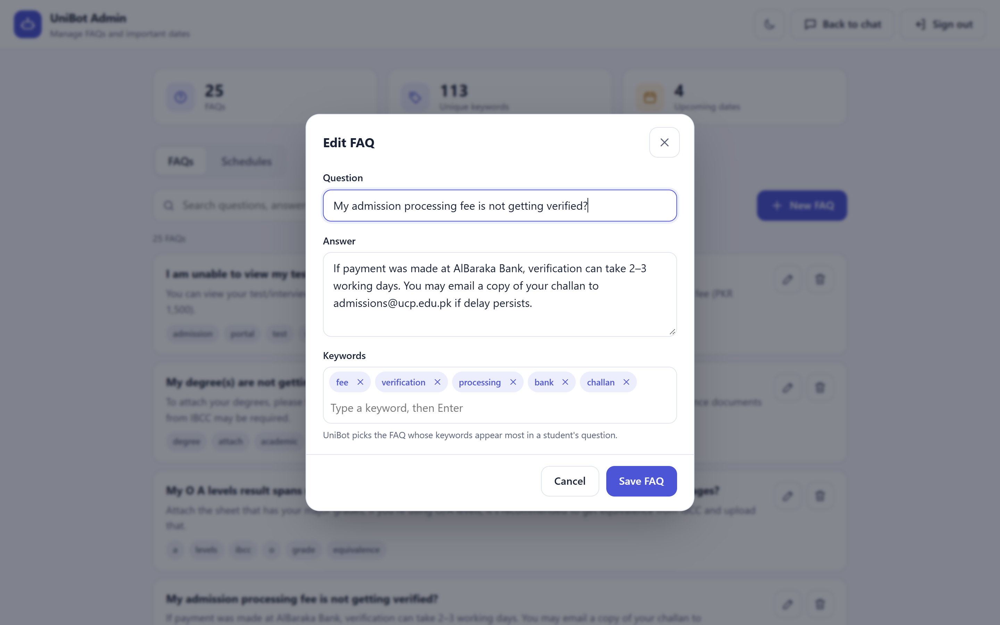
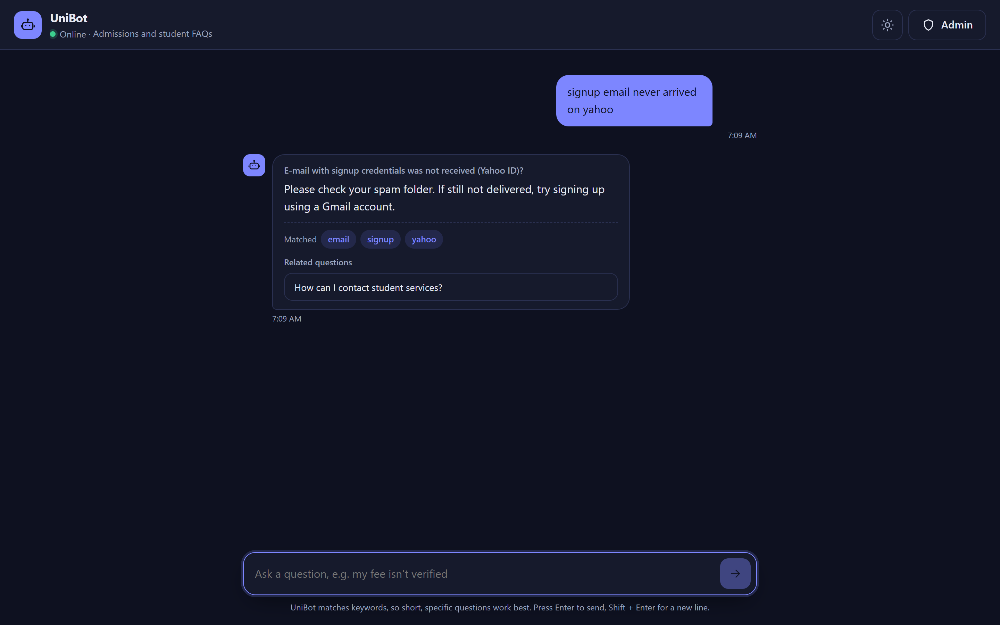
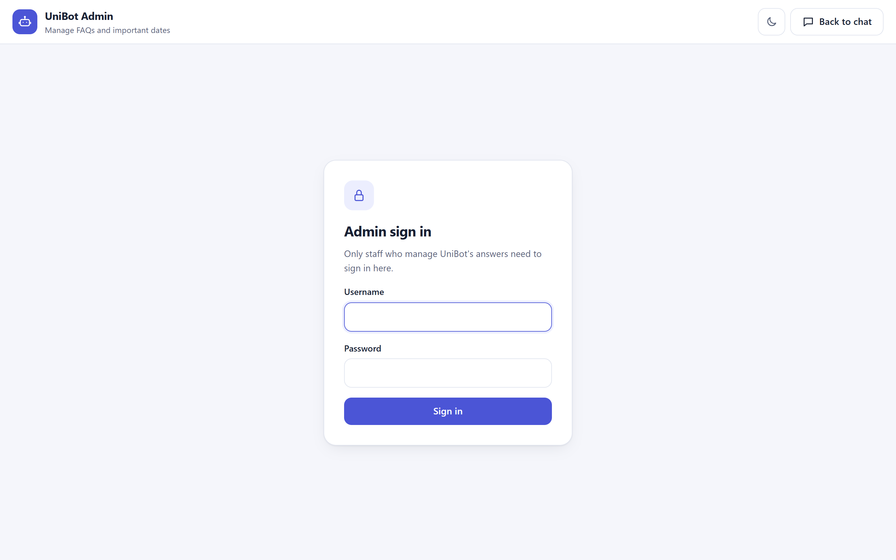
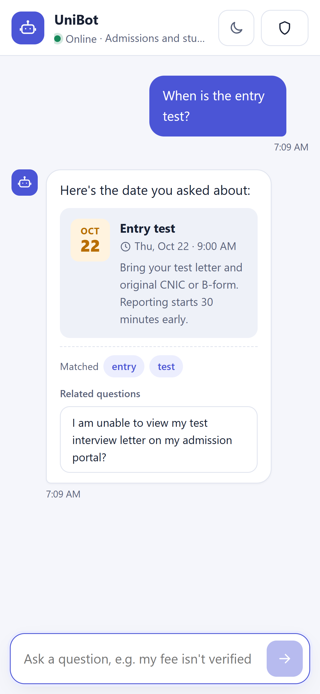

# UniBot



A university FAQ assistant. Students ask questions in a chat and UniBot answers from the
university's own FAQ list. Admins manage the questions, keywords and important dates (deadlines,
tests, orientation) from a web dashboard.

UniBot matches **keywords**, not AI, so answers are fast, predictable and always the official
wording.

**Live:** https://unibot.bugblazer.dev (signing in needs a @ucp.edu.pk email) · Built by [bugblazer](https://bugblazer.dev)



## Features

- **Chat:** suggested questions, related-question follow-ups, the keywords that matched, and a
  clear fallback when nothing matches.
- **Schedules:** students can ask "when is the entry test?" and get the date, time and details;
  upcoming dates also show on the welcome screen.
- **Admin dashboard:** search FAQs, add or edit questions with keyword chips, manage dated
  events, and see quick stats.
- **Light and dark mode**, keyboard friendly, and works on phones.

## Screenshots

| | |
|---|---|
|  |  |
|  |  |
|  |  |
|  |  |

## Run it

Requirements: a C++17 compiler (`g++`) and `curl`. On Windows, use Git Bash with MinGW-w64.

```bash
bash backend/compile.sh   # downloads Asio headers on first run, then builds ./unibot
```

Set admin credentials, either as environment variables:

```bash
export UNIBOT_ADMIN_USER=admin
export UNIBOT_ADMIN_PASS='a-strong-password'
```

or by copying `backend/data/admin.example.txt` to `backend/data/admin.txt` (username on the first
line, password on the second). `admin.txt` is git-ignored.

Then start the server from the repository root and open <http://localhost:18080>:

```bash
./unibot          # ./unibot.exe on Windows
```

### With Docker

```bash
docker build -t unibot .
docker run -d --name unibot --restart unless-stopped -p 18080:18080   -e UNIBOT_ADMIN_USER=admin -e UNIBOT_ADMIN_PASS='a-strong-password'   -v "$PWD/backend/data:/app/backend/data" unibot
```

The volume keeps FAQ and schedule edits when the container is rebuilt.

| Variable | Default | Purpose |
|---|---|---|
| `UNIBOT_PORT` | `18080` | Port to listen on |
| `UNIBOT_CONTACT` | A generic "contact the admissions office" message | Reply when no FAQ matches |
| `TZ` | System time zone | Decides which schedule dates count as upcoming, e.g. `Asia/Karachi` |

## How it works

- **Backend:** C++17 with [Crow](https://crowcpp.org) (vendored in `backend/third_party/crow_all.h`).
  It serves the web UI and a small JSON API.
- **Data:** plain text files in `backend/data/`: `faqs.txt` (`Q:`, `A:`, `K:` lines) and
  `schedules.txt` (`T:` title, `D:` date, `W:` time, `I:` details, `K:` keywords).
- **Matching:** each FAQ and schedule scores one point per keyword found in the question; the
  highest score wins, and ties go to FAQs.
- **Admin API:** `/admin/*` routes require a session token from `/admin/login` (valid for 8 hours).

| Endpoint | Description |
|---|---|
| `POST /ask` | `{ "question": "..." }` → answer, matched keywords, related questions |
| `GET /suggestions` | A few popular questions for the welcome screen |
| `GET /schedules` | Upcoming dates |
| `POST /admin/login` | Returns a session token |
| `GET/POST /admin/faqs`, `PUT/DELETE /admin/faqs/:id` | Manage FAQs |
| `GET/POST /admin/schedules`, `PUT/DELETE /admin/schedules/:id` | Manage dates |
